# Oracle JSON 


## Steps:#


 **Create and Load JSON data from External Table**

1. Login to PDB: Below are the details-
   
    ````
    <copy>
    Username: appjson
    Password: Oracle_4U
    PDB name: pdbjxl
    PORT: 1530
    </copy>
    ````
    
2. Create a directory
    
    We will create a directory which will point to the location where json dump file is stored-
     
    ````
    <copy>
    create or replace directory ORDER_ENTRY as '/home/oracle/Spatial/script/db-sample-schemas-19.2/order_entry/';
    
             </copy>
    ````
   
3. Create a simple table to store JSON documents
   
   In Oracle there is no dedicated JSON data type. JSON documents are stored in the database using standard Oracle data types such as VARCHAR2, CLOB and BLOB. 

   In order to ensure that the content of the column is valid JSON data, a new constraint **IS JSON**, is provided that can be applied to a column. This constraint returns TRUE if the content of the column is well-formed, valid JSON and FALSE otherwise.

   This first statement in this module creates a table which will be used to contain JSON documents.


    ````
    <copy>
    create table PURCHASE_ORDER (
    ID            RAW(16) NOT NULL,
    DATE_LOADED   TIMESTAMP(6) WITH TIME ZONE,
    PO_DOCUMENT CLOB CHECK (PO_DOCUMENT IS JSON)
    )
    /
    </copy>
    ````
    This statement creates a very simple table, PURCHASE-ORDER. The table has a column PO-DOCUMENT of type CLOB. The IS JSON constraint is applied to the column PO-DOCUMENT, ensuring that the column can store only well formed JSON documents.

3. Loading JSON Documents into the database  

    This statement creates a simple external table that can read JSON documents from a dump file generated by a typical No-SQL style database. In this case, the documents are contained in the file PurchaseOrders.dmp. The SQL directory object ORDER_ENTRY points to the folder containing the dump file, and also points to the database’s trace folder which will contain any ‘log’ or ‘bad’ files generated when the table is processed.

    ````
    <copy>
    CREATE TABLE PURCHASE_EXT(
    JSON_DOCUMENT CLOB
    )
    ORGANIZATION EXTERNAL(
    TYPE ORACLE_LOADER
    DEFAULT DIRECTORY ORDER_ENTRY
    ACCESS PARAMETERS (
    RECORDS DELIMITED BY 0x'0A'
    DISABLE_DIRECTORY_LINK_CHECK  
    BADFILE ORDER_ENTRY: 'PURCHASE_EXT.bad'
    LOGFILE ORDER_ENTRY: 'PURCHASE_EXT.log'
    FIELDS(
    JSON_DOCUMENT CHAR(5000)
    ) 
    )
    LOCATION (
     ORDER_ENTRY:'PurchaseOrders.dmp'
    )
    )
    PARALLEL
    REJECT LIMIT UNLIMITED
    /
 
       </copy>
    ````

4. Loading  data from the external table into JSON table
 
    The following statement copies the JSON documents from the dump file into the PURCHASE-ORDER table. 
    ````
    <copy>
    insert into PURCHASE_ORDER
    select SYS_GUID(), SYSTIMESTAMP, JSON_DOCUMENT 
    from PURCHASE_EXT
    where JSON_DOCUMENT IS JSON
    /
    commit
    /
    
    </copy>
    ````

  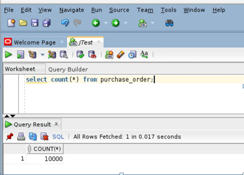
  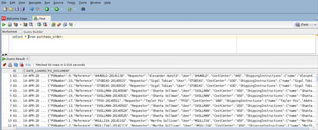

   **Customers who ordered products from specific Geo location( JavaScript Object Notation)**

1. Find Row Count.   

    ````
    <copy>
    select j.PO_DOCUMENT.Reference,
    j.PO_DOCUMENT.Requestor,
    j.PO_DOCUMENT.CostCenter,
    j.PO_DOCUMENT.ShippingInstructions.Address.city
    from PURCHASE_ORDER j 
    wherej.PO_DOCUMENT.ShippingInstructions.Address.city = 'South San Francisco'
    /

      </copy>
    ````
  
  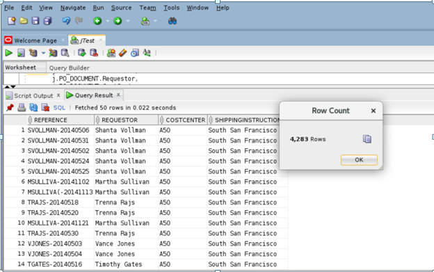
    
   **Note:** Oracle database allows a simple ‘dotted’ notation to be used to perform a limited set of operations on columns containing JSON.In order to use the dotted notation, a table alias must be assigned to the table in the FROM clause, and any reference to the JSON column must be prefixed with the assigned alias. All data is returned as VARCHAR2(4000).

**Find all customers who purchased an items tagged with a specific UPC (json_exists)**

1. Find Row Count   

    ````
    <copy>
    SELECT po.po_document.PONumber,po.po_document.Requestor
    FROM purchase_orderpo
    WHERE json_exists(po.po_document, '$?(@.LineItems.Part.UPCCode == 85391628927)'
    );

      </copy>
    ````
  
   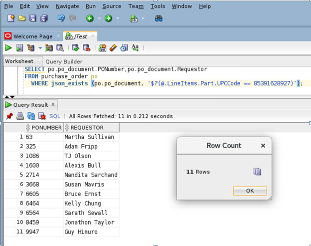
    
   **Note:** The JSON-EXISTS operator is used in the WHERE clause of a SQL statement. It is used to test whether or not a JSON document contains content that matches the provided JSON path expression.

   The JSON-EXISTS operator takes two arguments, a JSON column and a JSON path expression. It returns TRUE if the document contains a key that matches the JSON path expression, FALSE otherwise. JSON-EXISTS provides a set of modifiers that provide control over how to handle any errors encountered while evaluating the JSON path expression.

   [UPC, short form for  Universal Product Code, is a type of code printed on retail product packaging to aid in identifying a particular item. It consists of two parts – the machine-readable barcode, which is a series of unique black bars, and the unique 12-digit number beneath it.]

**Find the customers who all are purchased a specific products**

1. Find Row Count   

    ````
    <copy>
    select D.* from PURCHASE_ORDER p,
    JSON_TABLE(
    p.PO_DOCUMENT,
    '$' 
    columns(
           PO_NUMBER            NUMBER(10)                  path  '$.PONumber',
           REFERENCE            VARCHAR2(30 CHAR)           path  '$.Reference',
           REQUESTOR            VARCHAR2(32 CHAR)           path  '$.Requestor',
           USERID               VARCHAR2(10 CHAR)           path  '$.User',
           COSTCENTER           VARCHAR2(16)                path  '$.CostCenter',
           NESTED PATH '$.LineItems[*]'
    columns(
             ITEMNO         NUMBER(16)             path '$.ItemNumber', 
             DESCRIPTION    VARCHAR2(32 CHAR)      path '$.Part.Description', 
             UPCCODE        VARCHAR2(14 CHAR)      path '$.Part.UPCCode', 
             QUANTITY       NUMBER(5,4)            path '$.Quantity', 
             UNITPRICE      NUMBER(5,2)            path '$.Part.UnitPrice'
           )
         )
       ) D
    where PO_NUMBER = 1600  
    /

      </copy>
    ````
  
   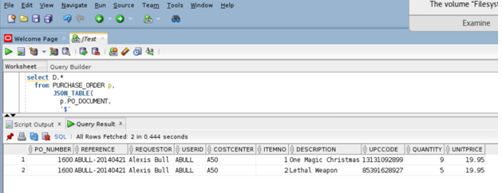

2. Find Row Count.
    
    ````
    <copy>
    select D.* from PURCHASE_ORDER p,
    JSON_TABLE(
    p.PO_DOCUMENT,
    '$' 
    columns(
           PO_NUMBER            NUMBER(10)                  path  '$.PONumber',
           REFERENCE            VARCHAR2(30 CHAR)           path  '$.Reference',
           REQUESTOR            VARCHAR2(32 CHAR)           path  '$.Requestor',
           USERID               VARCHAR2(10 CHAR)           path  '$.User',
           COSTCENTER           VARCHAR2(16)                path  '$.CostCenter',
           NESTED PATH '$.LineItems[*]'
    columns(
             ITEMNO         NUMBER(16)             path '$.ItemNumber', 
             DESCRIPTION    VARCHAR2(32 CHAR)      path '$.Part.Description', 
             UPCCODE        VARCHAR2(14 CHAR)      path '$.Part.UPCCode', 
             QUANTITY       NUMBER(5,4)            path '$.Quantity', 
             UNITPRICE      NUMBER(5,2)            path '$.Part.UnitPrice'
           )
         )
       ) D
    where description='A Walk on the Moon'
    /
     </copy>
    ````
    
   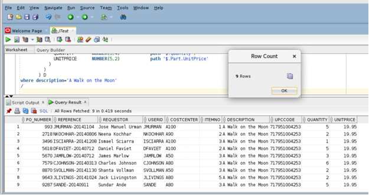
    
**Notes:**The JSON_TABLE operator uses a set of JSON path expressions to map content from a JSON document into columns in the view. Once the contents of the JSON document have been exposed as columns, all of the power of SQL can be brought to bear on the content of JSON document.

**How many orders were done by a customer with minimum 7 quantity and unit price minimum 25$ in  each   order (MV – sql queries)**

1. Note : With the simple SQL queries
 
  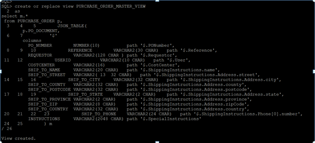 
  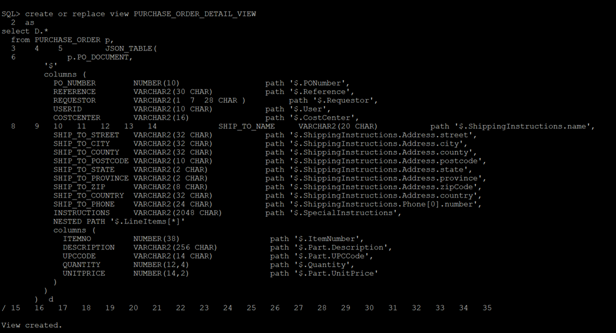 

    ````
    <copy>
    select PO_NUMBER, REFERENCE, INSTRUCTIONS, ITEMNO, UPCCODE, DESCRIPTION, QUANTITY, UNITPRICE
    from PURCHASE_ORDER_DETAIL_VIEW d
    where REQUESTOR = 'Steven King'
    and QUANTITY  > 7
    and UNITPRICE > 25.00
    /

      </copy>
    ````
  
  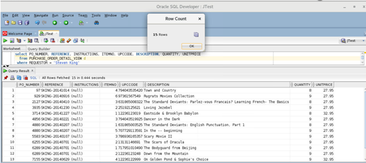 
    
**Notes:**  The above statements show how, once the relational views have been created, the full power of SQL can now be applied to JSON content, without requiring any knowledge of the structure of the JSON or how to manipulate JSON using SQL.

**Customer Purchase History Details (Json-Query&Json-value)**

1. Find Row Count   

    ````
    <copy>
    select JSON_QUERY(PO_DOCUMENT,'$.LineItems[0]' PRETTY) LINEITEMS
    from PURCHASE_ORDER p
    wherec(PO_DOCUMENT,'$.Requestor') = 'Alexis Bull'
    /

      </copy>
    ````
  
  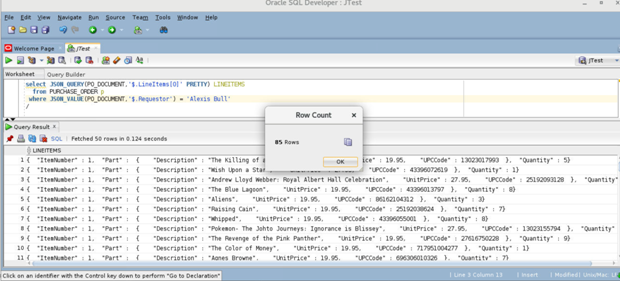
    
2. Without Pretty 

   ````
    <copy>
    select JSON_QUERY(PO_DOCUMENT,'$.LineItems[0]') LINEITEMS
    from PURCHASE_ORDER p
    where JSON_VALUE(PO_DOCUMENT,'$.Requestor') = 'Alexis Bull'
    /
    </copy>
    ````

  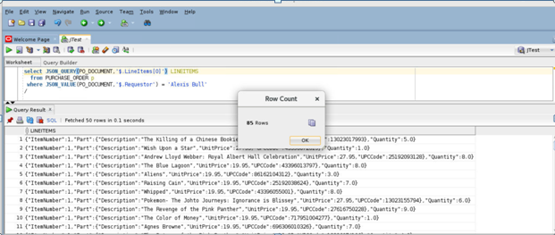
  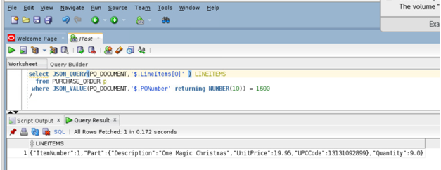

  **Notes:** Json-value selects a scalar value from JSON data and returns it as a SQL value. You can also use json_value to create function-based B-tree indexes for use with JSON data — see Indexes for JSON Data. Function json-value has two required arguments and accepts optional returning and error clauses

**DML OPERATIONS**

1. Find  Count   

    ````
    <copy>
    select count(*) from purchase_order;

      </copy>
    ````
     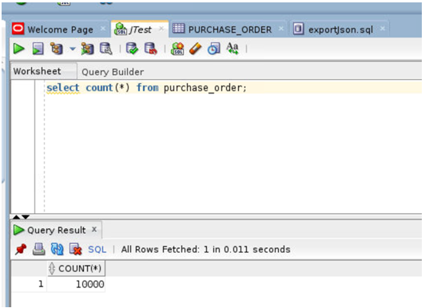


    
2. Find Count

    ````
    <copy>
    select * from purchase_order j where j.po_document.PONumber=10000;

      </copy>
    ````
     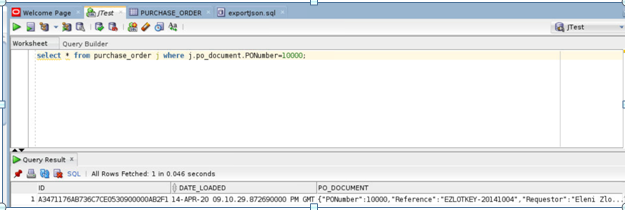


3. Find Count
   
    ````
    <copy>
   select * from purchase_order j where j.po_document.PONumber=10001; 
    </copy>
    ````
     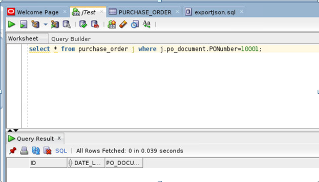

4. Insert Records.
    
    ````
    <copy>
    
     INSERT INTO purchase_order
     VALUES (
     SYS_GUID(),
     to_date('05-MAY-2020'),
     '{"PONumber"             : 10001,
      "Reference"            : "SBELL-20141017",
      "Requestor"            : "Sarah Bell",
      "User"                 : "SBELL",
      "CostCenter"           : "A50",
      "ShippingInstructions" : {"name"    : "Sarah Bell",
      "Address" : {"street"  : "200 Sporting Green",
      "city"    : "South San Francisco",
      "state"   : "CA",
      "zipCode" : 99236,
      "country" : "United States of America"},
     "Phone"   : "983-555-6509"},
      "Special Instructions" : "Courier",
      "LineItems"            : [{"ItemNumber" : 1,
      "Part"       : {"Description" : "Making the Grade",
      "UnitPrice"   : 20,
      "UPCCode"     : 27616867759},
      "Quantity"   : 8.0},
      {"ItemNumber" : 2,
      "Part"       : {"Description" : "Nixon",
      "UnitPrice"   : 19.95,
      "UPCCode"     : 717951002396},
      "Quantity"   : 5},
      {"ItemNumber" : 3,
      "Part"       : {"Description" : "Eric Clapton: Best Of 1981-1999",
      "UnitPrice"   : 19.95,
      "UPCCode"     : 75993851120},
      "Quantity"   : 5.0}
      ]}');
       
       </copy>
    ````
    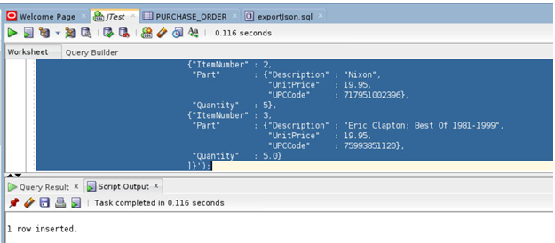
    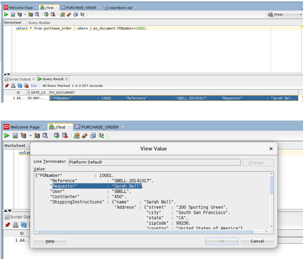

5. Update Records.

   ````
    <copy>
   update purchase_order set  
   PO_DOCUMENT = json_mergepatch (PO_DOCUMENT,
   '{
        "Requestor" : "MSDhoni"
    }'
    )  where id ='A4E055B4CF4A23A4E0530900000A60C2';


    </copy>
    ````
     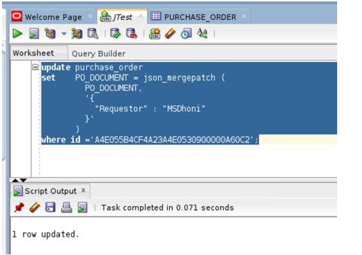  

6. Find  Count   

    ````
    <copy>
    select * from purchase_order j where j.po_document.PONumber=10001;

      </copy>
    ````
     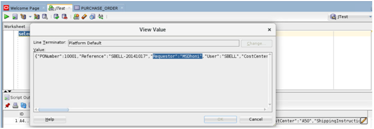

7. Find  Count   

    ````
    <copy>
    select count(*) from purchase_order;

      </copy>
    ````
     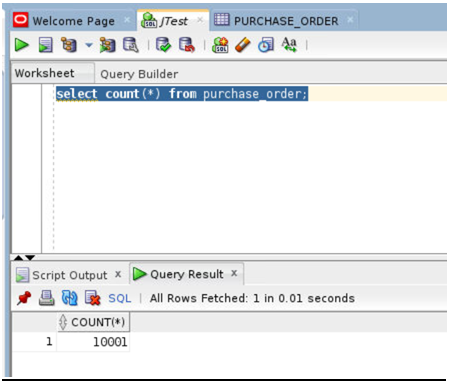

8. Find  Count   

    ````
    <copy>
    select * from purchase_order where id ='A4E055B4CF4A23A4E0530900000A60C2';

      </copy>
    ````
     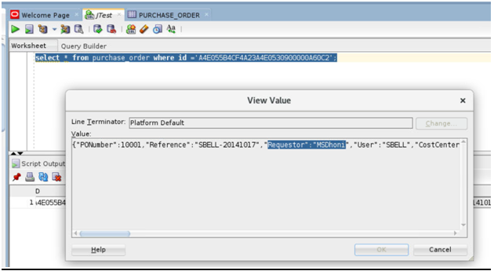


9. Delete Records.    

    ````
    <copy>
    delete from purchase_order where id ='A4E055B4CF4A23A4E0530900000A60C2';

      </copy>
    ````
     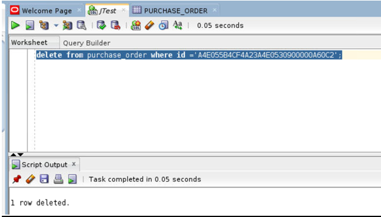


10. Find Count.    

    ````
    <copy>
    select count(*) from purchase_order;

      </copy>
    ````
     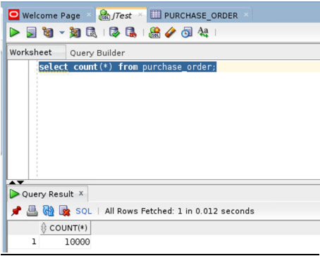
     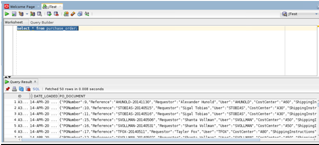


  