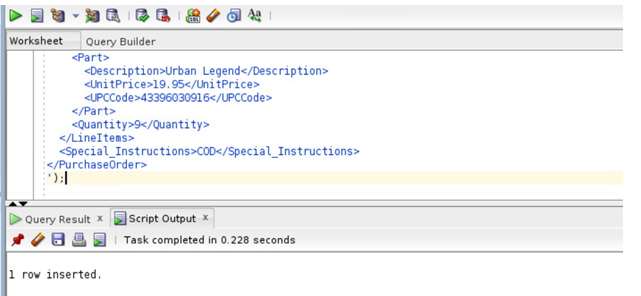
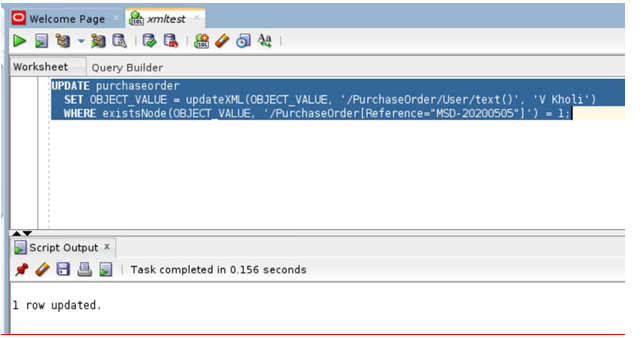
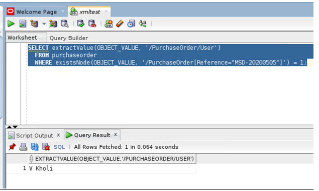

## Steps


**INSERT into XML DATA**

1. Lets take a count of the rows we have currently and then will do a insert-
    
     ````
    <copy>
    select t.object_value.getclobval() from purchaseorder t;

     </copy>
    ````

   


2. Lets take a count of the rows we have currently and then will do a insert-
    
    
    ````
    <copy>
     Insert into purchaseorder values (' <PurchaseOrder> <PONumber>10001</PONumber>      <Reference>MSD-20200505</Reference>
         <Requestor>MS Dhoni</Requestor>     <User> TGATES </User>         <CostCenter>A50</CostCenter>         <ShippingInstructions>
         <name>MS Dhoni</name> <Address>  <street>200 Sporting Green</street><city>South San Francisco</city>
         <state>CA</state>         <zipCode>99236</zipCode>
         <country>United States of America</country> </Address>
         <Phone> <type>Office</type>
         <number>131-555-5589</number> </Phone>
         </ShippingInstructions>         <LineItems>
         <ItemNumber>1</ItemNumber>         <Part>
         <Description>Ivanhoe</Description>         <UnitPrice>19.95</UnitPrice>
         <UPCCode>66479101648</UPCCode>         </Part>
         <Quantity>2</Quantity>         </LineItems>
         <LineItems>         <ItemNumber>2</ItemNumber>
         <Part>         <Description>Karaoke: Classic Country Hits Vol. 3 203</Description>
         <UnitPrice>19.95</UnitPrice>         <UPCCode>13023003897</UPCCode>
         </Part>         <Quantity>2</Quantity>
         </LineItems>         <LineItems>
         <ItemNumber>3</ItemNumber>         <Part>
         <Description>Urban Legend</Description>         <UnitPrice>19.95</UnitPrice>
         <UPCCode>43396030916</UPCCode>         </Part>
         <Quantity>9</Quantity>         </LineItems>
         <Special_Instructions>COD</Special_Instructions>         </PurchaseOrder>
          ');
          
        </copy>
    ````
     
     

3. Take the count again-
    
     ````
    <copy>
    select t.object_value.getclobval() from purchaseorder t;    
         
         </copy>
    ````
    


**UPDATE**

   We can update XML content, replacing either the entire contents of a document or only particular parts of a document. 
   The ability to perform partial updates on XML documents is very powerful, particularly when we make small changes to large documents, as it can significantly reduce the amount of network traffic and disk input-output required to perform the update.
   
4. The Oracle UPDATEXML function allows us to update XML content stored in Oracle Database.
    
      ````
    <copy>
    UPDATE purchaseorder
    set object_value=updateXML(OBJECT_VALUE, '/PurchaseOrder/User/text()', 'V Kholi')
     WHERE existsNode(OBJECT_VALUE, '/PurchaseOrder[Reference="MSD-20200505"]')=1;
     /
         
       </copy>
       ````


    

5.  Run Select query
     
       ````
    <copy>

     SELECT extractValue(OBJECT_VALUE, '/PurchaseOrder/User')
       FROM purchaseorder
             WHERE existsNode(OBJECT_VALUE, '/PurchaseOrder[Reference="MSD-20200505"]') =1;
     /

     </copy>
       ````
    

